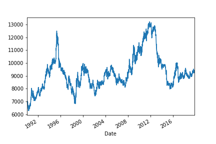
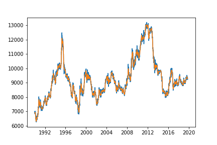
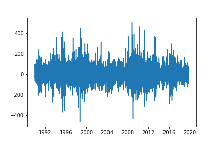
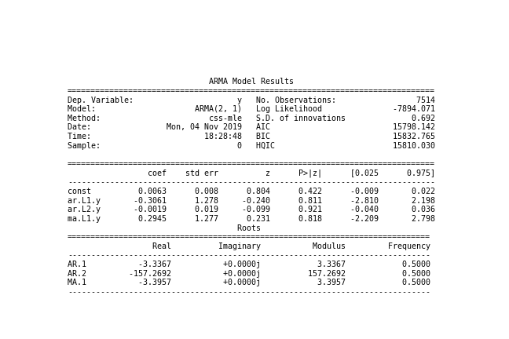
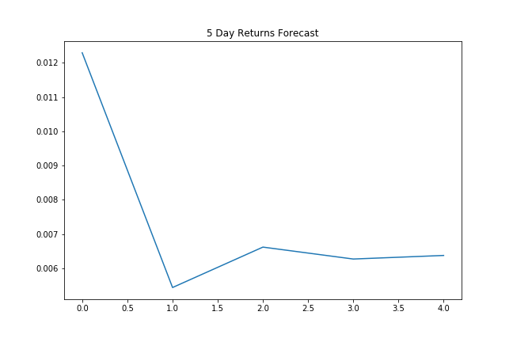
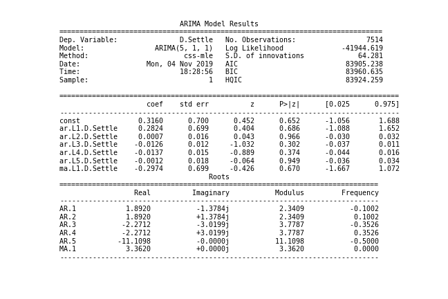
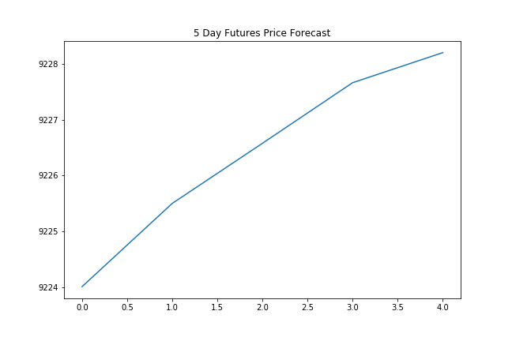
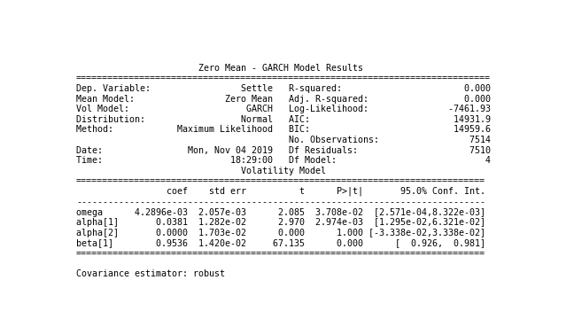
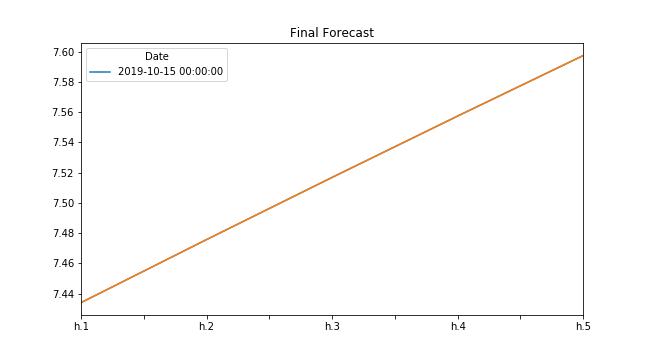

## Time-Series Forecasting
#### Initial Time-Series Plotting

#### Settle Price vs the Trend

#### Settle Noise

#### Forecasting Returns using an ARMA Model

5 Day Returns Forecast

#### Forecasting Returns using an ARMIA Model

5 Day Returns Forecast

#### Volatility Forecasting with GARCH

Final Forecast

1. Based on your time series analysis, would you buy the yen now?
* Yes there looks to be some short term buying opportunities as indicated by the ARMA and ARIMA models. 

2. Is the risk of the yen expected to increase or decrease?
The GARCH model forecasts that the risk of the Yen will increase in the near term. 

3. Based on the model evaluation, would you feel confident in using these models for trading?

* As the ARMA and ARIMA models are not good fits (P values >0.05), I would look to refine the models more before trading.  

### Linear Regression Forecasting
First 20 predictions vs the true values

Does this model perform better or worse on out-of-sample data compared to in-sample data?

* Out-of-Sample Root Mean Squared Error (RMSE): 0.4151933603075715
* In-sample Root Mean Squared Error (RMSE): 0.5657562717010388

As the Out-of-Sample Root Mean Squared Error is the lowest, the models performs best Out-of-Sample.

